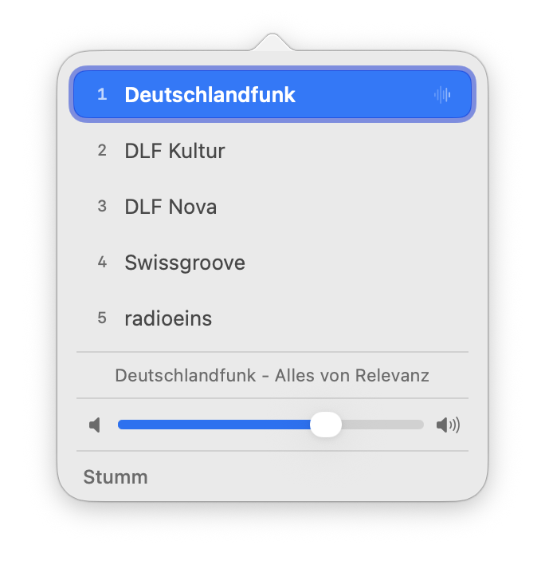
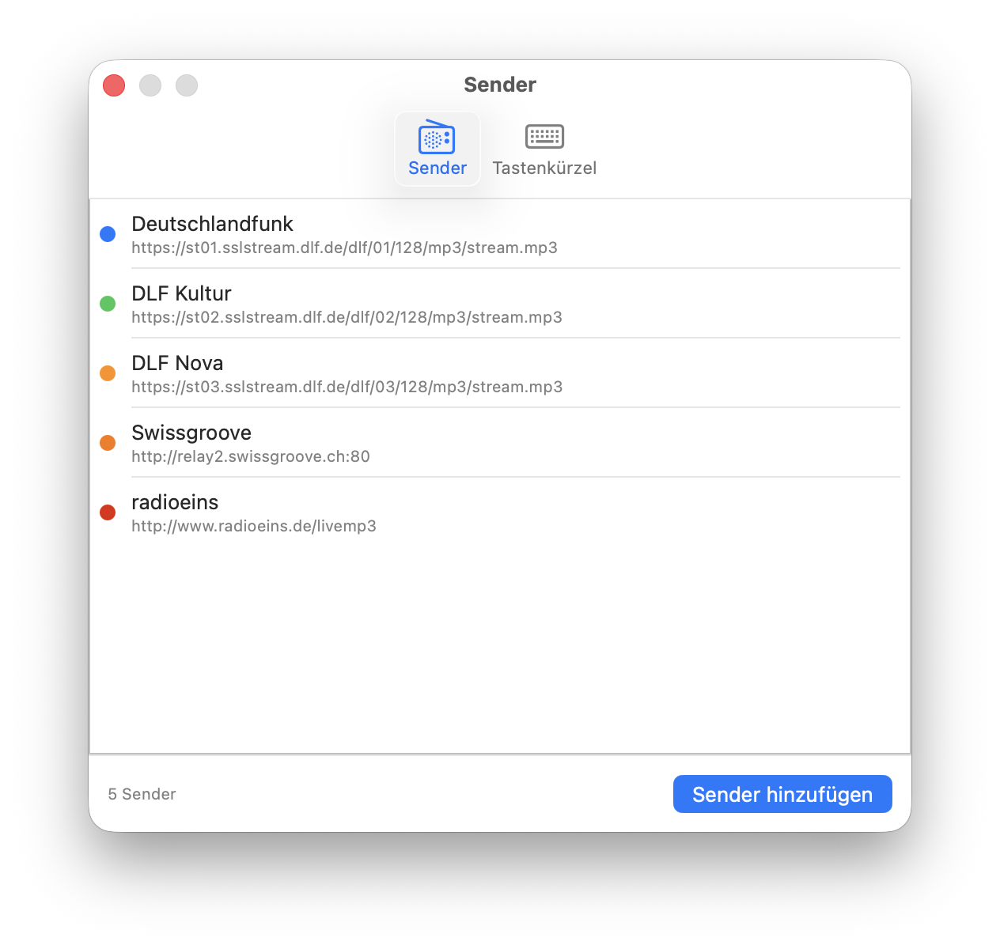
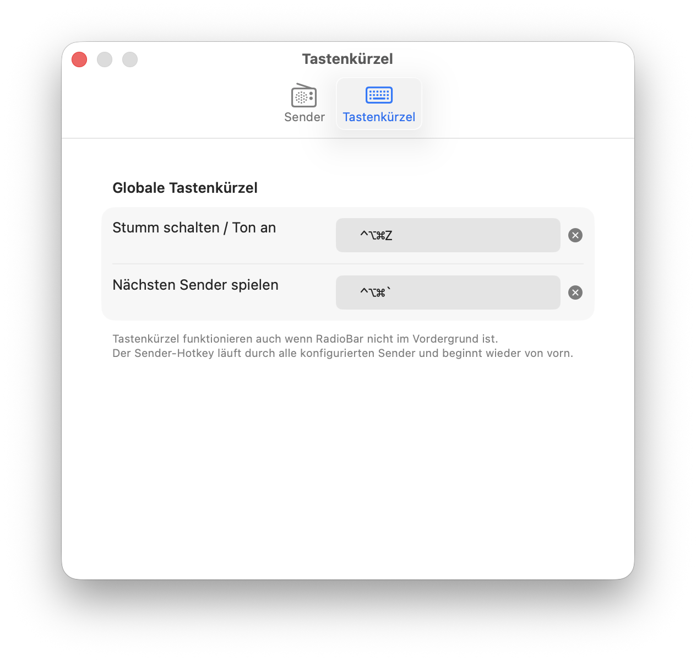

# RadioBar

Eine schlanke macOS-Menüleisten-App zum Abspielen von Internet-Radiosendern.



## Features

- **Beliebige Livestreams** – MP3, AAC und HLS werden unterstützt
- **Farbiger Menüleisten-Punkt** – zeigt die Akzentfarbe des aktiven Senders; grau wenn gestoppt oder stumm
- **Linksklick** öffnet die Senderauswahl mit Lautstärkeregler und aktuellem Song-Titel
- **Rechtsklick** öffnet ein Kontextmenü zum schnellen Umschalten, Stummschalten und Beenden
- **Tastaturkürzel 1–9** wechseln den Sender direkt aus dem Popover
- **Globale Hotkeys** für Stumm und Senderwechsel – funktionieren auch wenn RadioBar im Hintergrund ist
- **Media-Tasten** der Mac-Tastatur werden unterstützt (Play/Pause)
- **Now Playing** – aktueller Titel wird im macOS-Kontrollzentrum angezeigt
- Kein Dock-Icon – lebt ausschließlich in der Menüleiste

## Screenshots



*Sender verwalten: Name, Stream-URL und Akzentfarbe frei konfigurierbar*



*Globale Tastenkürzel per Klick aufnehmen – werden sicher im Schlüsselbund gespeichert*

## Installation

1. [`RadioBar.zip`](https://github.com/noestreich/radiobar/releases/latest) herunterladen und entpacken
2. `RadioBar.app` in den Ordner `/Programme` ziehen
3. Starten – die App erscheint als Punkt in der Menüleiste

> Die App ist mit einem **Developer ID**-Zertifikat signiert und von Apple notarisiert. Es erscheint kein Gatekeeper-Dialog.

## Selbst bauen

Xcode wird nicht benötigt – nur die Command Line Tools.

```bash
# Command Line Tools installieren (falls noch nicht vorhanden)
xcode-select --install

# Repository klonen und bauen
git clone https://github.com/noestreich/radiobar.git
cd radiobar
./build.sh

# App starten
open RadioBar.app
```

### Signierter Release-Build

```bash
# Einmalig: Credentials im Schlüsselbund speichern
xcrun notarytool store-credentials "radiobar-notarize" \
    --apple-id "deine@apple-id.de" \
    --team-id  "DEINE_TEAM_ID"

# Build, Signierung und Notarisierung
./build-release.sh
```

## Systemvoraussetzungen

- macOS 14 (Sonoma) oder neuer
- Apple Silicon oder Intel

## Lizenz

MIT
