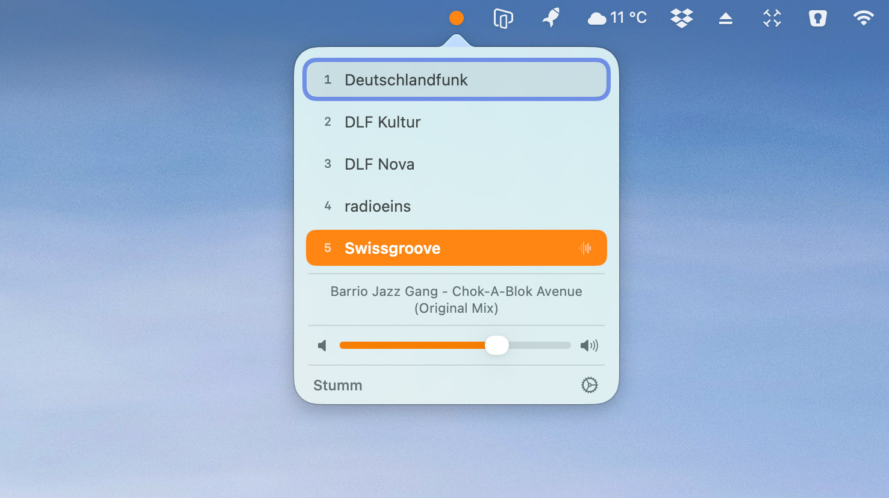
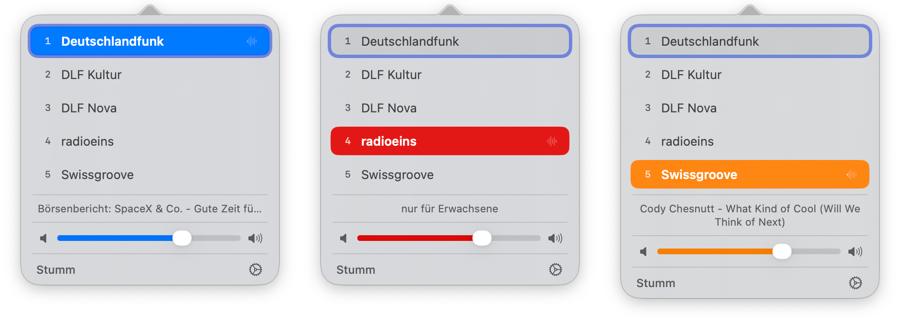
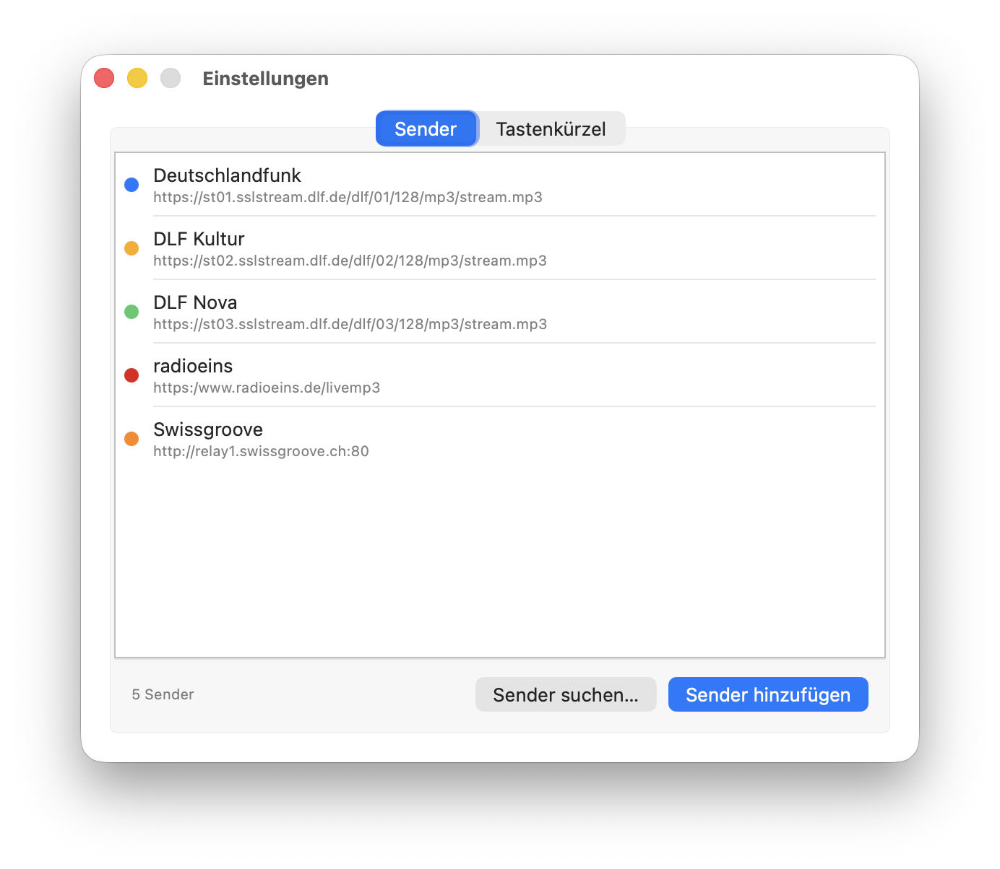
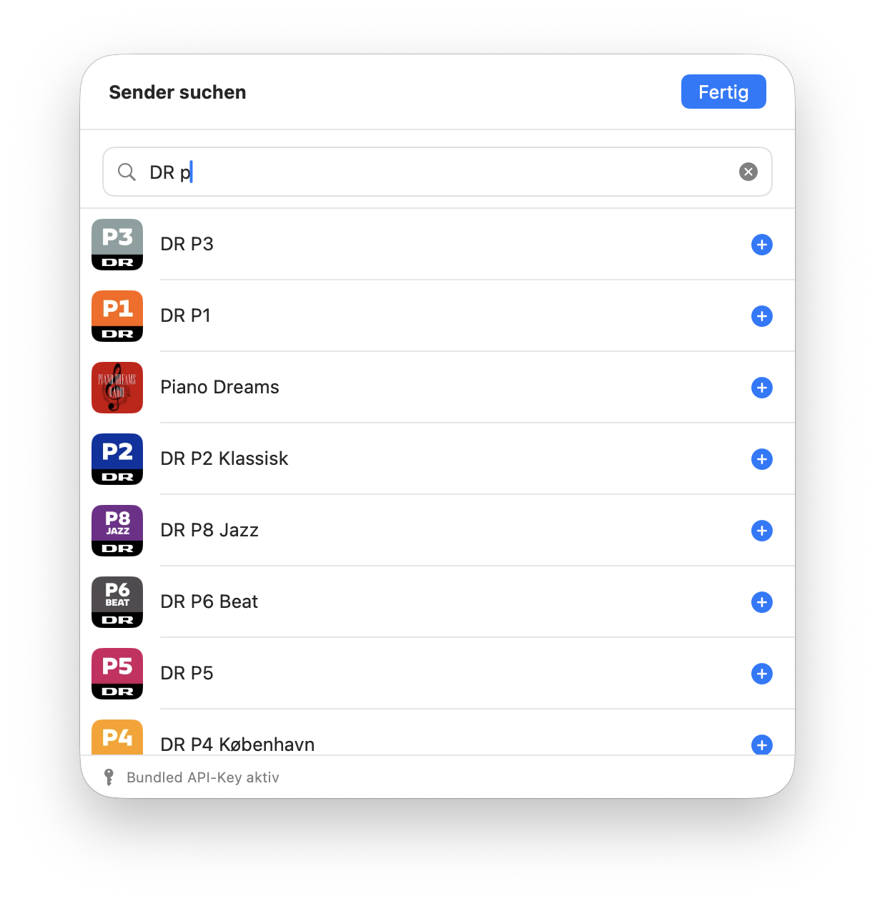
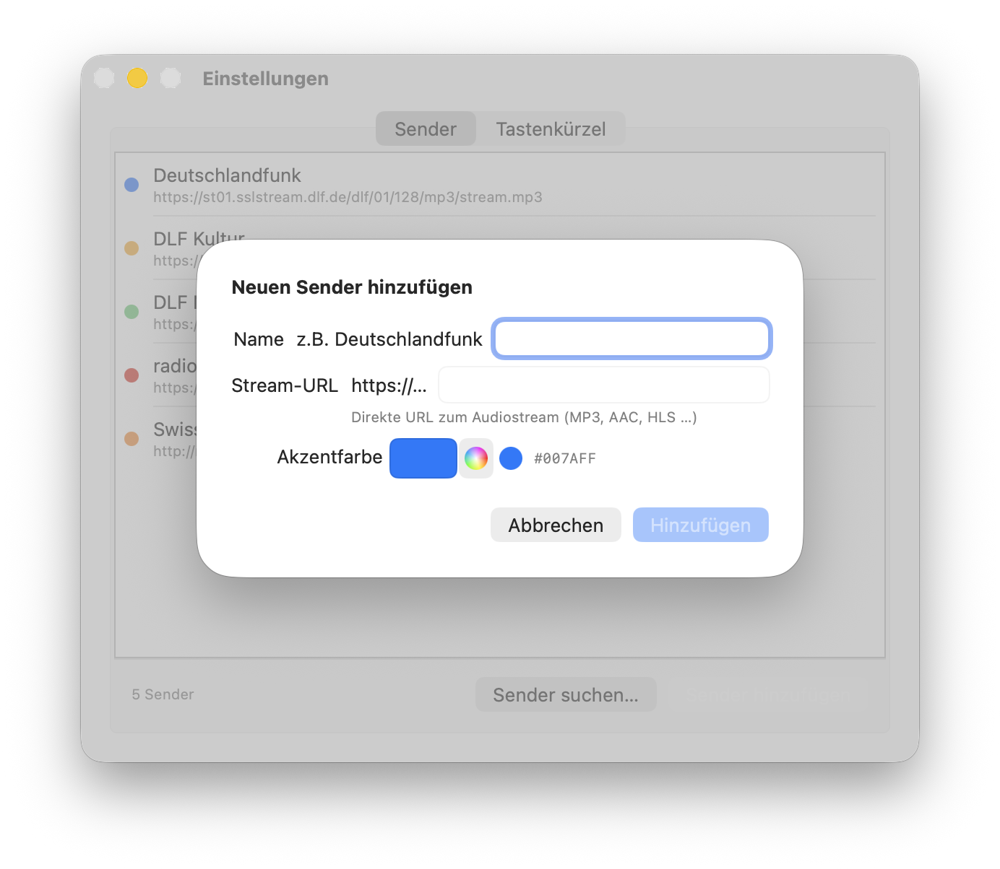

# RadioBar

Eine schlanke macOS-Menüleisten-App zum Abspielen von Internet-Radiosendern – ohne Dock-Icon, ohne Ablenkung.



## Features

- **Sendersuche** – Tausende Sender direkt in der App finden und mit einem Klick hinzufügen, keine Stream-URL nötig
- **Beliebige Livestreams** – MP3, AAC und HLS werden unterstützt; Stream-URL lässt sich manuell eintragen
- **Farbiger Menüleisten-Punkt** – zeigt die Akzentfarbe des aktiven Senders; grau wenn gestoppt oder stumm
- **Linksklick** öffnet die Senderauswahl mit Lautstärkeregler und aktuellem Song-Titel
- **Rechtsklick** öffnet ein Kontextmenü zum schnellen Umschalten, Stummschalten und Beenden
- **Tastaturkürzel 1–9** wechseln den Sender direkt aus dem Popover
- **Globale Hotkeys** für Stumm und Senderwechsel – funktionieren auch wenn RadioBar im Hintergrund ist
- **Media-Tasten** der Mac-Tastatur werden unterstützt (Play/Pause)
- **Now Playing** – aktueller Titel wird im macOS-Kontrollzentrum angezeigt
- Kein Dock-Icon – lebt ausschließlich in der Menüleiste

## Screenshots



*Jeder Sender bekommt eine eigene Akzentfarbe – der Menüleisten-Punkt und der Lautstärkeregler passen sich automatisch an*

---



*Sender verwalten: per Sendersuche hinzufügen, manuell eintragen oder per Drag & Drop umsortieren*

---



*Sendersuche: Tausende Sender durchsuchen, Logos und Länder auf einen Blick – einfach auf + tippen zum Hinzufügen*

---



*Sender manuell hinzufügen: Name, Stream-URL und Akzentfarbe frei wählbar*

## Installation

1. [`RadioBar-signed.zip`](https://github.com/noestreich/radiobar/releases/latest) herunterladen und entpacken
2. `RadioBar.app` in den Ordner `/Programme` ziehen
3. Starten – die App erscheint als Punkt in der Menüleiste

> Die App ist mit einem **Developer ID**-Zertifikat signiert und von Apple notarisiert. Es erscheint kein Gatekeeper-Dialog.

## Sender hinzufügen

Der einfachste Weg: In den Einstellungen auf **„Sender suchen…"** klicken. Die integrierte Suche kennt Tausende Sender – einfach Namen, Genre oder Land eingeben und mit **+** zur Liste hinzufügen. Eine Stream-URL muss dafür nicht bekannt sein.

Alternativ lässt sich jeder Sender auch manuell über **„Sender hinzufügen"** eintragen, sofern die direkte Stream-URL (MP3, AAC, HLS) bekannt ist.

## Selbst bauen

Xcode wird nicht benötigt – nur die Command Line Tools.

```bash
# Command Line Tools installieren (falls noch nicht vorhanden)
xcode-select --install

# Repository klonen und bauen
git clone https://github.com/noestreich/radiobar.git
cd radiobar
./build.sh

# App starten
open RadioBar.app
```

> **Hinweis:** Self-Builds enthalten keinen eingebetteten API-Key für die Sendersuche.
> Beim ersten Öffnen von „Sender suchen…" wird nach einem eigenen [StreamURL-API-Key](https://streamurl.link) gefragt, der einmalig sicher im macOS-Schlüsselbund gespeichert wird.

### Signierter Release-Build mit eingebettetem API-Key

```bash
# Einmalig: Notarisierungs-Credentials im Schlüsselbund speichern
xcrun notarytool store-credentials "radiobar-notarize" \
    --apple-id "deine@apple-id.de" \
    --team-id  "DEINE_TEAM_ID"

# Build mit eingebettetem StreamURL-Key (optional)
STREAMURL_API_KEY="dein-api-key" ./build-release.sh

# Oder ohne eingebetteten Key
./build-release.sh
```

## Systemvoraussetzungen

- macOS 14 (Sonoma) oder neuer
- Apple Silicon oder Intel

## Lizenz

MIT
